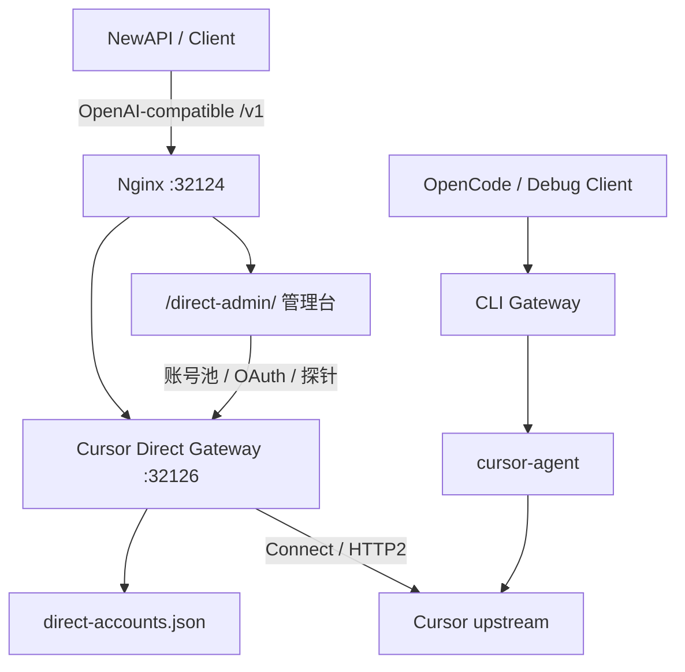

# Cursor Proxy

一个面向自有 Cursor 账号的 OpenAI-compatible 代理网关。项目保留了
`opencode-cursor` 的 OpenCode 插件能力，同时新增了更适合接入 NewAPI
和团队内部网关的 Cursor Direct Gateway、多账号号池、OAuth 登录管理台与
Nginx 部署配置。

> 请只在你拥有账号授权、并符合相关服务条款与公司合规要求的场景中使用。
> 不要把个人凭证、refresh token、管理密码或 API key 提交到仓库。

## 功能概览

- **OpenAI-compatible API**
  - `GET /v1/models`
  - `POST /v1/chat/completions`
  - 可直接作为 NewAPI 的 OpenAI 兼容渠道。
- **Cursor Direct Gateway**
  - 通过 Cursor 上游接口完成请求，不需要每次请求都启动 CLI 进程。
  - 支持 `auto`、`composer-2-fast` 等 Cursor 模型别名。
- **CPA 式管理台**
  - 单页查看账号池、启用/禁用账号、刷新 token、删除账号。
  - 支持粘贴 `auth.json` 单账号导入、批量 JSON 导入。
  - 支持生成 Cursor OAuth 授权链接并导入登录态。
  - 支持模型列表、延迟探针、NewAPI Base URL 一键复制。
- **CLI Gateway**
  - 保留基于 `cursor-agent` 的兼容代理，适合稳定优先或调试场景。
- **部署脚本**
  - 提供 systemd service 和 Nginx 反代配置。
  - 默认只暴露一个公网端口，由 Nginx 分流管理台与 `/v1` API。

## 项目结构

```text
cursor-direct-gateway.mjs          Cursor Direct 网关与管理 API
direct-admin-page.mjs              Direct Gateway 单页管理台
admin-shared.mjs                   管理台共享样式与前端工具
cursor-gateway.mjs                 cursor-agent CLI 网关
deploy/cursor-direct-gateway.service
deploy/cursor-nginx.conf
deploy/install-cursor-direct-gateway.sh
deploy/install-cursor-nginx.sh
tests/unit/cursor-direct-gateway.test.mjs
tests/unit/cursor-gateway-admin.test.mjs
```

## 运行要求

- Node.js 20+，推荐 Node.js 22+
- 已安装 Cursor CLI / `cursor-agent`
- 有可用的 Cursor 登录态或可完成 OAuth 登录
- 如果要公网部署：一台 Linux 服务器、systemd、Nginx

## 本地快速启动

### 1. 安装依赖

```bash
npm install
```

### 2. 启动 Direct Gateway

```bash
export CURSOR_DIRECT_API_KEY="replace-with-a-long-random-key"
export CURSOR_DIRECT_ADMIN_PASSWORD="replace-with-a-long-admin-password"
export CURSOR_DIRECT_REQUIRE_API_KEY=true

node ./cursor-direct-gateway.mjs
```

默认监听：

```text
API:   http://127.0.0.1:32126/v1
Admin: http://127.0.0.1:32126/direct-admin/
Health:http://127.0.0.1:32126/health
```

### 3. 添加账号

打开管理台：

```text
http://127.0.0.1:32126/direct-admin/
```

输入 `CURSOR_DIRECT_ADMIN_PASSWORD` 后，可以选择：

- 粘贴 Cursor `auth.json`，导入单个账号。
- 粘贴批量 JSON，导入多个账号。
- 点击 OAuth 登录，生成授权链接并导入新账号。

账号池文件默认保存到：

```text
~/.config/cursor/direct-accounts.json
```

完整 token 不会在管理 API 或页面中明文返回，只显示 masked preview。

## NewAPI 接入

在 NewAPI 中新增渠道：

```text
类型: OpenAI 兼容
Base URL: http://<host>:32124/v1
API Key: CURSOR_DIRECT_API_KEY
模型: auto / composer-2-fast / composer-2.5-fast
```

如果你直接连接 Direct Gateway 本地端口，则 Base URL 是：

```text
http://127.0.0.1:32126/v1
```

公网部署时推荐只暴露 Nginx 端口，例如：

```text
http://<server-ip>:32124/v1
http://<server-ip>:32124/direct-admin/
```

`/direct-admin-preview/` 已经合并为正式入口跳转，不再维护重复页面。

## Direct Gateway 环境变量

| 变量 | 默认值 | 说明 |
| --- | --- | --- |
| `CURSOR_DIRECT_HOST` | `127.0.0.1` | Direct Gateway 监听地址 |
| `CURSOR_DIRECT_PORT` | `32126` | Direct Gateway 监听端口 |
| `CURSOR_DIRECT_API_KEY` | 空 | `/v1` 调用密钥 |
| `CURSOR_DIRECT_REQUIRE_API_KEY` | 根据 API key 自动判断 | 是否要求 API key |
| `CURSOR_DIRECT_ADMIN_PASSWORD` | API key 或空 | 管理台密码 |
| `CURSOR_DIRECT_AUTH_PATH` | `~/.config/cursor/auth.json` | 兼容旧单账号 auth 文件 |
| `CURSOR_DIRECT_ACCOUNTS_PATH` | auth 目录下 `direct-accounts.json` | 多账号号池文件 |
| `CURSOR_DIRECT_API_BASE_URL` | `https://api2.cursor.sh` | Cursor API base |
| `CURSOR_DIRECT_AGENT_HOST` | `agentn.api5.cursor.sh` | Cursor AgentService host |
| `CURSOR_DIRECT_CLIENT_VERSION` | `cli-2026.05.24-dda726e` | Cursor client version header |
| `CURSOR_DIRECT_IDLE_MS` | `1200` | 流式响应空闲收尾时间 |
| `CURSOR_DIRECT_TIMEOUT_MS` | `60000` | 单次请求硬超时 |
| `CURSOR_DIRECT_MODELS_CACHE_TTL_MS` | `300000` | 模型列表缓存时间 |
| `CURSOR_DIRECT_LOG_LEVEL` | `info` | 日志等级 |

## 管理 API

所有 `/direct-admin/api/*` 接口需要管理密码：

```text
X-Admin-Password: <CURSOR_DIRECT_ADMIN_PASSWORD>
Authorization: Bearer <CURSOR_DIRECT_ADMIN_PASSWORD>
```

常用接口：

```text
GET    /direct-admin/api/status
GET    /direct-admin/api/accounts
POST   /direct-admin/api/accounts/import
POST   /direct-admin/api/accounts/:id/enable
POST   /direct-admin/api/accounts/:id/disable
POST   /direct-admin/api/accounts/:id/refresh-token
DELETE /direct-admin/api/accounts/:id
GET    /direct-admin/api/oauth/session
POST   /direct-admin/api/oauth/start
POST   /direct-admin/api/oauth/callback
GET    /direct-admin/api/models
POST   /direct-admin/api/probe
```

导入单个账号：

```json
{
  "label": "main-account",
  "authJson": "{\"accessToken\":\"...\",\"refreshToken\":\"...\"}"
}
```

批量导入：

```json
{
  "accounts": [
    {
      "label": "account-a",
      "accessToken": "...",
      "refreshToken": "..."
    },
    {
      "label": "account-b",
      "accessToken": "...",
      "refreshToken": "..."
    }
  ]
}
```

## 服务器部署

仓库内提供了一套较薄的部署脚本，适合已经有 `cursor-gateway.env`
或想把 Direct Gateway 作为独立服务部署到服务器的场景。

### 部署 Direct Gateway

把文件上传到服务器 `/tmp`：

```bash
scp cursor-direct-gateway.mjs direct-admin-page.mjs admin-shared.mjs \
  deploy/cursor-direct-gateway.service \
  deploy/install-cursor-direct-gateway.sh \
  user@server:/tmp/
```

在服务器执行：

```bash
bash /tmp/install-cursor-direct-gateway.sh
```

该脚本会安装：

```text
/opt/cursor-direct-gateway/cursor-direct-gateway.mjs
/opt/cursor-direct-gateway/direct-admin-page.mjs
/opt/cursor-direct-gateway/admin-shared.mjs
/etc/systemd/system/cursor-direct-gateway.service
```

并重启：

```text
cursor-direct-gateway
```

### 部署 Nginx

```bash
scp deploy/cursor-nginx.conf user@server:/tmp/
sudo install -o root -g root -m 0644 /tmp/cursor-nginx.conf /etc/nginx/conf.d/cursor-nginx.conf
sudo nginx -t
sudo systemctl reload nginx
```

默认 Nginx 端口是 `32124`：

```text
http://<server-ip>:32124/direct-admin/
http://<server-ip>:32124/v1
```

如果你的服务器在中国大陆且域名未备案，建议不要监听 80/443，
直接使用已放行的高位端口。

## CLI Gateway

仓库仍保留基于 `cursor-agent` 的 CLI Gateway：

```bash
export CURSOR_GATEWAY_API_KEY="replace-with-a-long-random-key"
export CURSOR_GATEWAY_ADMIN_PASSWORD="replace-with-a-long-admin-password"
npm run gateway
```

默认：

```text
http://127.0.0.1:32124/admin/
http://127.0.0.1:32124/v1
```

CLI Gateway 每次请求会调用 `cursor-agent`，稳定性较好，但冷启动和延迟通常高于 Direct Gateway。

## OpenCode 插件

本项目保留上游 `opencode-cursor` 的插件代码。如果你只想在 OpenCode
中调用 Cursor 模型，可参考上游插件文档与本仓库 `src/`、`scripts/`
目录。当前 fork 的新增重点是独立网关、Direct Gateway 与管理台。

## 架构示意



## 安全建议

- 不要把 `auth.json`、`direct-accounts.json`、`.env`、API key 或 refresh token 提交到 Git。
- 管理台密码和 API key 分开配置。
- 公网只暴露 Nginx 入口，不要直接暴露 Direct Gateway 内部端口。
- NewAPI 渠道使用单独的长随机 key。
- 定期检查账号池中失败次数、最后错误和 token 过期时间。

## 测试

```bash
node --check admin-shared.mjs
node --check direct-admin-page.mjs
node --check cursor-direct-gateway.mjs
node --check cursor-gateway.mjs
node --test tests/unit/cursor-direct-gateway.test.mjs tests/unit/cursor-gateway-admin.test.mjs
```

## 致谢与参考

本项目是在多个开源项目和社区实践基础上迭代出来的：

- [Nomadcxx/opencode-cursor](https://github.com/Nomadcxx/opencode-cursor)
  本仓库的基础来源，提供 OpenCode + Cursor 集成、插件结构和早期 CLI 代理能力。
- [router-for-me/CLIProxyAPI](https://github.com/router-for-me/CLIProxyAPI)
  参考了其 CLI 代理、中转站部署和管理体验的思路。
- [Quorinex/Kiro-Go](https://github.com/Quorinex/Kiro-Go)
  参考了其账号管理、网关化部署和管理台交互模式。
- NewAPI 社区生态
  本项目的 `/v1` 兼容接口和部署方式以接入 NewAPI 渠道为主要目标之一。

如果你基于本项目继续开发，请保留上游项目的版权与许可证信息，并在发布时标注你的修改内容。

## License

上游项目包含 ISC / BSD-3-Clause 等许可信息，具体以仓库内 `LICENSE`
和上游文件声明为准。本 fork 的新增代码请在遵守上游许可证的前提下使用。
